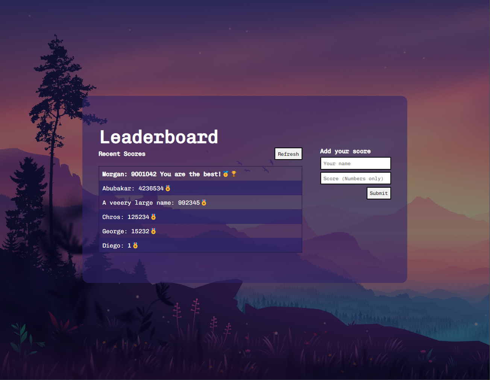

<a name="readme-top"></a>

<div align="center">

  
  <br/>

  <h3><b>LeaderBoard Project</b></h3>

</div>

<!-- TABLE OF CONTENTS -->

# 📗 Table of Contents

- [📖 About the Project](#about-project)
  - [🛠 Built With](#built-with)
    - [Tech Stack](#tech-stack)
    - [Key Features](#key-features)
  - [🚀 Live Demo](#live-demo)
- [💻 Getting Started](#getting-started)
  - [Setup](#setup)
  - [Prerequisites](#prerequisites)
  - [Install](#install)
  - [Usage](#usage)
- [👥 Authors](#authors)
- [🔭 Future Features](#future-features)
- [🤝 Contributing](#contributing)
- [⭐️ Show your support](#support)
- [🙏 Acknowledgements](#acknowledgements)
- [❓ FAQ](#faq)
- [📝 License](#license)


# 📖 LeaderBoard Project <a name="about-project"></a>


> This project showcases a dynamic Scoreboard application, allowing users to add new scores and view a leaderboard of the highest scores. Developed utilizing JavaScript and a leaderboard API, this project demonstrates proficiency in utilizing external APIs and JavaScript programming.

## 🛠 Built With <a name="built-with"></a>

### Tech Stack <a name="tech-stack"></a>

> Javacript  
> CSS3
> Html
> APIs

<details>
  <summary>Client</summary>
  <ul>
    <li><a href="https://code.visualstudio.com/">VSCode</a></li>
    <li><a href="https://developer.mozilla.org/">JavaScript</a></li>
  </ul>
</details>


### Key Features <a name="key-features"></a>

- **The page consist on a leaderboard table**
- **Use of an API to get and post the scores**
- **Flexible design for mobiles and desktops**

<p align="right">(<a href="#readme-top">back to top</a>)</p>


## 🚀 Live Demo <a name="live-demo"></a>


- [GitHub Pages Live Demo](https://taldr27.github.io/Leaderboard/)


<p align="right">(<a href="#readme-top">back to top</a>)</p>

## Image preview:

<div>
  
</div>


## 💻 Getting Started <a name="getting-started"></a>

To get a local copy up and running, follow these steps:

### Prerequisites
In order to run this project you need:

> - Git
> - Visual Studio Code


### Setup

Clone this repository to your desired folder:

```
git clone git@github.com:taldr27/Leaderboard.git

cd Leaderboard
```

### Installation

Install dependencies of this project with:

```
npm install
```

### Usage
To run the project, execute the following command:
```
npm run start
```

<p align="right">(<a href="#readme-top">back to top</a>)</p>

<!-- AUTHORS -->

## 👥 Author <a name="authors"></a>

👤 **Diego Garcia**

- GitHub: [@taldr27](https://github.com/taldr27)
- LinkedIn: [diegogarcial](https://www.linkedin.com/in/diegogarcial/)

<p align="right">(<a href="#readme-top">back to top</a>)</p>

## 🔭 Future Features <a name="future-features"></a>


- [ ] **Add a button to delete scores**
- [ ] **Add a functionality to create a new table ID to clean all the scores**


<!-- CONTRIBUTING -->

## 🤝 Contributing <a name="contributing"></a>

Contributions, issues, and feature requests are welcome!

Feel free to check the [issues page](../../issues/).


<!-- SUPPORT -->

## ⭐️ Show your support <a name="support"></a>


If you like this project, please give a start and suggest possible changes 
to make it better.


## ❓ FAQ <a name="faq"></a>


- **Can I add a lot of scores?**

  - Yes you can.

- **Do I need to be connected to the Internet?**

  - Yes, to be able to grab the information from the API.


## 🙏 Acknowledgments <a name="acknowledgements"></a>

I would like to thank Microverse for providing the guide to build this project.
I would like to thank to the code reviewers for their reviews.

## 📝 License <a name="license"></a>

This project is [MIT](./LICENSE) licensed.

<p align="right">(<a href="#readme-top">back to top</a>)</p>